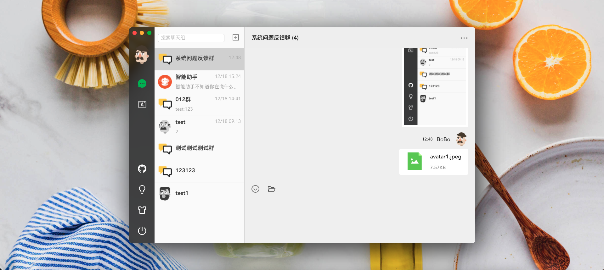
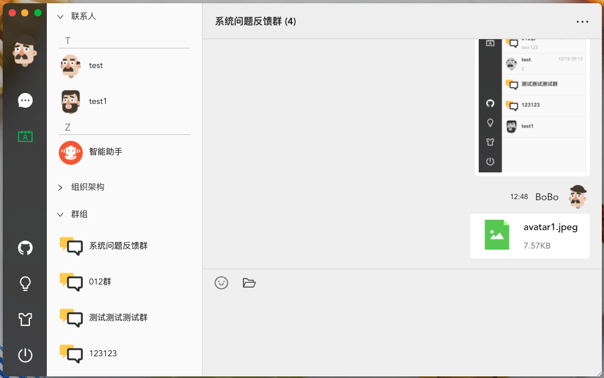
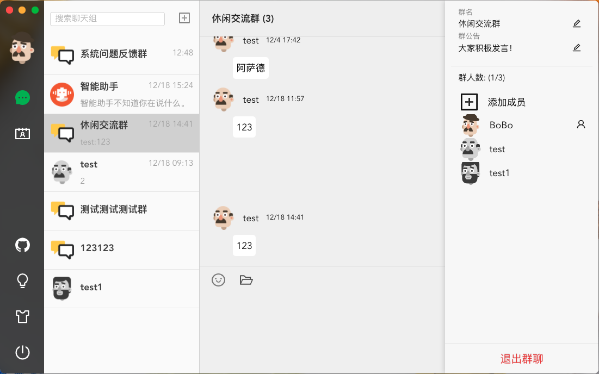
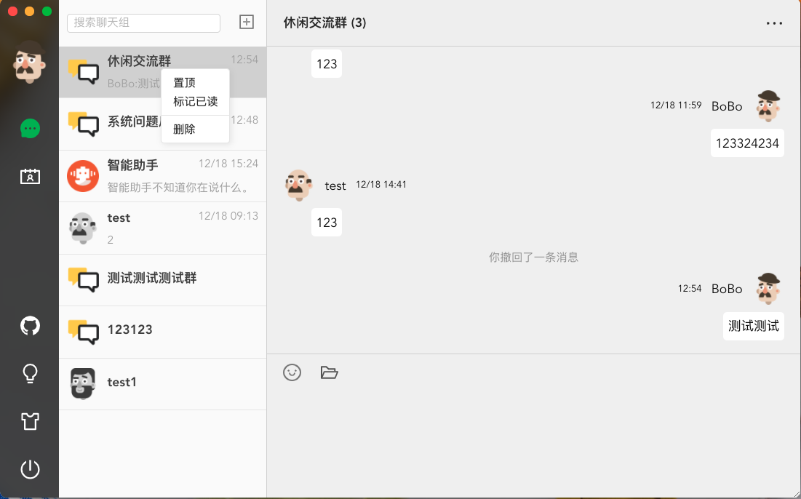
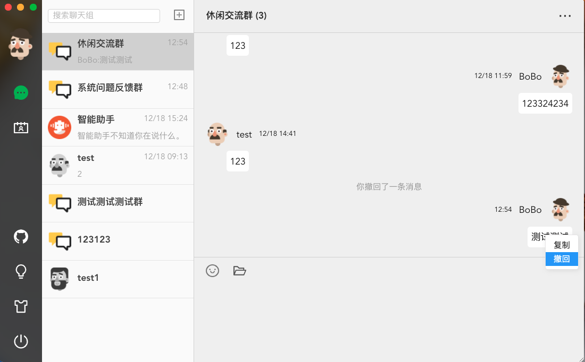
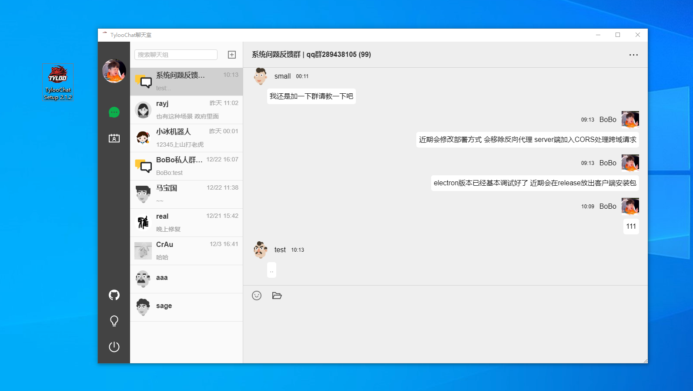
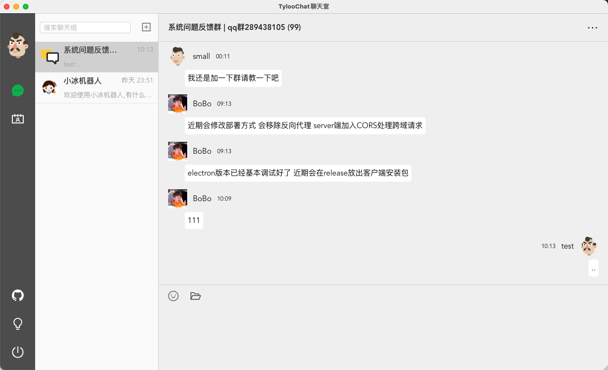

# Tyloo-Chat(仿wechat)
[](https://github.com/BoBoooooo)
[](https://github.com/BoBoooooo/tyloo-chat)
[](http://nodejs.org/download)
[](https://github.com/BoBoooooo/tyloo-chat/LICENSE)
[](https://github.com/BoBoooooo/tyloo-chat)

## 说明
本项目fork自[genal-chat]('https://github.com/genaller/genal-chat.git')做了优化升级,感谢大佬`Genal`开源提供思路!

目前还在抽空持续优化中,敬请期待!!!

觉得还不错的话可以点个Star鼓励一下!!!

## 🚀 Electron版本客户端已出炉,详见release

## 🚀 欢迎各位大佬提提意见建议/Bug反馈 qq群`289438105`

## [🏖Tyloo-Chat线上demo地址](http://tyloochat.fun:9999/)
**tips: 麻烦各位绿色聊天,不要开车,不要上传太大的文件,服务器比较垃圾..**

## 部分功能截图
- 整体界面


- 通讯录



- 群聊功能(群成员列表,在线状态,支持添加群成员)

- 会话列表(置顶/删除)


- 消息撤回功能



## Electron版本客户端(位于electron_version分支)
- windows版本(exe)



- mac版本(dmg)


## Feature
- 用户登陆注册 (支持嵌入第三方系统单点登陆)
    - [单点登陆地址](http://server.boboooooo.top:9998),登录后点击右上角在线交流按钮
- 群聊 (类似qq群)
    - 邀请好友加入群聊
    - 修改群名/群公告
- 好友功能
- 通讯录功能(支持接入第三方系统组织架构,直接发起聊天)
- 聊天功能
    - Emoji表情包
    - 图片发送/图片预览
    - 发送附件
    - 消息分页
    - 消息撤回/复制
- 自定义主题
- 会话置顶/删除
- 重连提醒
- **智能助手(默认,位于main分支,采用ES搜索引擎需要手动创建ES词库)**
- **第三方API机器人(当前线上demo版本,位于feature_APIROBOT分支)**
- **Electron版本(位于electron_version分支,支持生成dmg,exe客户端)**
## 技术栈
- **前端**
	- **vue cli 4.x**
    - **Antd for vue**
- **后端**
	- **NestJS**
    - **TypeORM**
	- **Mysql**
- **Socket.io**

- **ElasticSearch** ES搜索引擎(用于机器人快捷自动回复)
- **[Nodejieba](https://github.com/yanyiwu/nodejieba)** node版本中文分词器
## 数据库表结构设计


## 环境准备
- mysql
- chat数据库 (需要手动创建,**注意数据库编码格式为 `utf8bm64``utf8bm64``utf8bm64` !!!**)
- node v10.16.3

## 拉取代码时注意事项

```
// windows系统需要配置一下,提交时转换为LF，检出时不转换
git config --global core.autocrlf input
```

```
// 设置为区分大小写
git config core.ignorecase false
```

## 运行项目
```js
// client
cd client 
cnpm i
npm start
```

```js
// server
cd server
cnpm i
npm run start
```

## 如何部署

[Deploy](./deploy.md)

[CentOS下部署聊天室](https://notes.zhangxiaocai.cn/posts/39142aea.html)

## 第三方集成/单点登陆

- 第三方系统里嵌入如下跳转代码,需要携带`userId`以及`username`参数

``` javascript
let chatUrl // 当前聊天室客户端地址
let userId // 当前系统用户userId
let username // 当前系统用户昵称

window.open(`${chatUrl}?userId=${userId}&username=${username}`);

```

- 聊天室获取参数并自动完成登陆(若为首次登陆会自动注册账号)

- 设置聊天室client `VUE_APP_ORG_URL` 为获取第三方系统组织架构的接口地址

    - 设置VUE_APP_ORG_URL
    ``` javascript

    // .env.xxx
    // 此接口可以获取到第三方系统的所有部门和人员信息,注意为嵌套tree结构
    VUE_APP_ORG_URL=http://127.0.0.1:8080/api/getDeptUsersTree

    ```

    - 切换到联系人界面自动发出请求
    ``` javascript
    // Contact.vue
    axios.post(process.env.VUE_APP_ORG_URL).then((res) => {
        this.organizationArr = res.data.data;
    });
    ```

    - 返回值格式如下
    ``` javascript
    interface node {
        id: string; // id
        label: string;// 名称
        flag: boolean;// 是否有下级结点
        children: node[];// 下级结点
    }
    ```
    - 若不需要集成第三方组织架构清空`VUE_APP_ORG_URL`即可,其他情况自行定制修改。

## 思路概述
[webSocket建立流程](./webSocket建立流程.md)
## TODO
- `@功能实现`
- `消息转发`
- `代码性能优化`
- `群聊功能继续完善`
- `微信快捷登陆`
- `Electron客户端检查更新`
